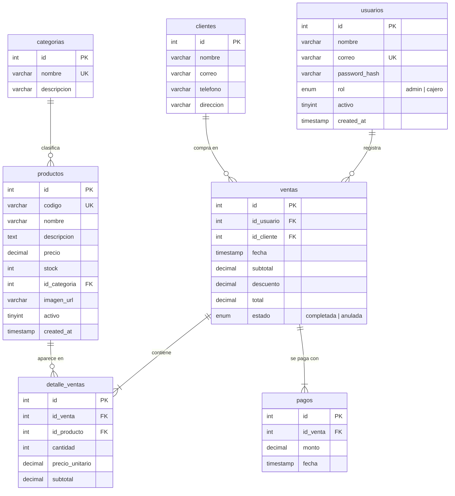

# Diagrama Entidad–Relación (ER)

Base de datos `pos_tienda` — 7 tablas relacionadas y normalizadas.

> El diagrama está en formato **Mermaid**. Se ve renderizado automáticamente
> en GitHub. Para exportarlo como imagen para el PDF, puedes pegar el código en
> <https://mermaid.live> y descargar el PNG/SVG.

## Relaciones (cardinalidad)

| Relación | Tipo | Descripción |
|----------|------|-------------|
| `categorias` → `productos` | 1 : N | Una categoría agrupa muchos productos |
| `usuarios` → `ventas` | 1 : N | Un usuario (cajero/admin) registra muchas ventas |
| `clientes` → `ventas` | 1 : N | Un cliente puede tener muchas ventas |
| `ventas` → `detalle_ventas` | 1 : N | Una venta contiene varias líneas de detalle |
| `productos` → `detalle_ventas` | 1 : N | Un producto aparece en muchos detalles |
| `ventas` → `pagos` | 1 : N | Registro del cobro en efectivo de cada venta |

## Normalización

- **1FN:** todos los atributos son atómicos; no hay grupos repetidos.
- **2FN:** cada tabla tiene clave primaria simple (`id`); los atributos dependen
  por completo de la clave.
- **3FN:** no hay dependencias transitivas — por ejemplo, el nombre de la
  categoría no se repite en `productos`, se referencia con `id_categoria`; el
  precio de venta se "congela" en `detalle_ventas.precio_unitario` para conservar
  el histórico aunque cambie el precio del producto.
