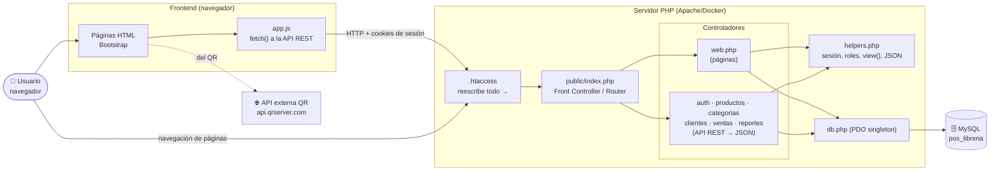
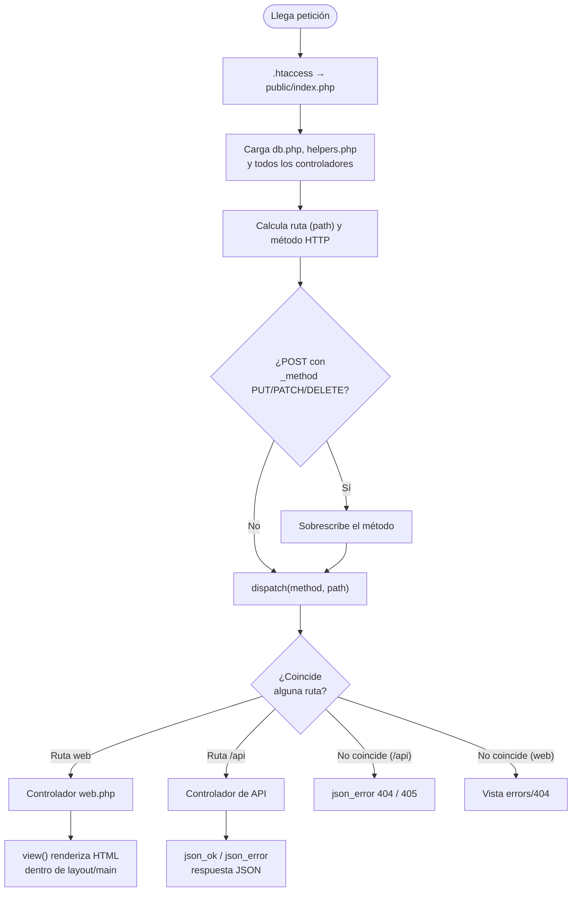
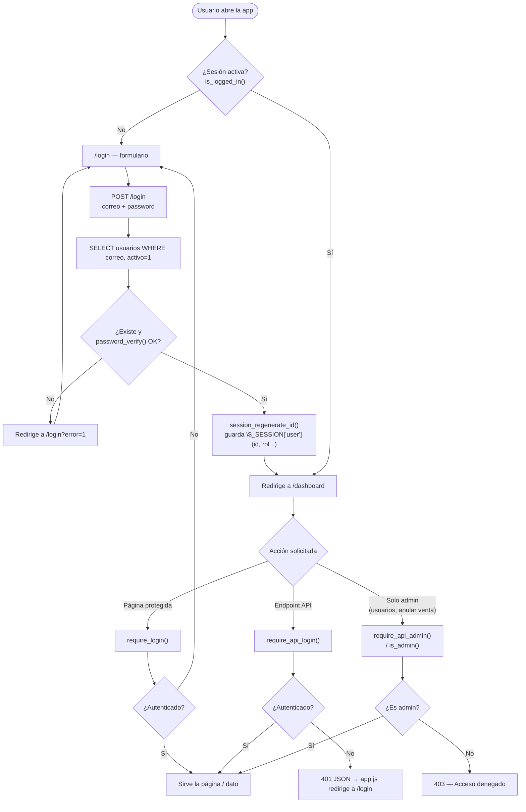
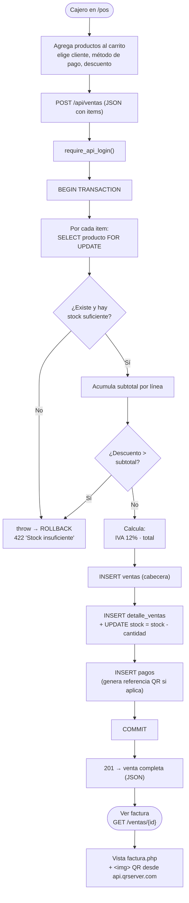

# Diagrama de Flujo — POS Web (Tienda El Estudiante)

Documento que explica **cómo funciona la aplicación**: el ciclo de vida de una
petición, la autenticación por roles y el flujo del proceso central (registrar
una venta). Los diagramas están en formato **Mermaid** (se renderizan solos en
GitHub y en VS Code con la extensión de Mermaid).

---

## 1. Arquitectura general

Aplicación **PHP puro** (sin framework) con patrón *Front Controller*. Un único
punto de entrada (`public/index.php`) despacha dos tipos de rutas:

- **Rutas web** → devuelven páginas HTML (Bootstrap).
- **Rutas `/api`** → API REST propia que devuelve JSON.

El navegador consume la API con `fetch` (ver `public/assets/js/app.js`).

---

## 2. Ciclo de vida de una petición (Router)

Todo pasa por `public/index.php`, que calcula la ruta y el método, aplica el
*method override* (para PUT/DELETE desde formularios) y hace *match* contra la
tabla de rutas.

---

## 3. Autenticación y control de roles

Hay dos vías de login (formulario web y API), ambas verifican la contraseña con
**bcrypt** (`password_verify`) contra la tabla `usuarios` y guardan al usuario en
`$_SESSION`. Los roles son **`admin`** y **`cajero`**.

---

## 4. Flujo del proceso central: registrar una venta (POS)

El corazón del sistema. El cajero arma el carrito en `/pos`, el navegador envía
`POST /api/ventas` y el servidor procesa **todo en una transacción atómica**:
valida stock (con `FOR UPDATE`), calcula importes, guarda cabecera + detalle,
descuenta stock, registra el pago y hace `commit`. Luego se puede imprimir la
**factura con código QR**.

> **Anulación** (`POST /api/ventas/{id}/anular`): solo **admin**. Devuelve el
> stock de cada línea y marca la venta como `anulada`, también en una transacción.

---

## 5. Módulos y rutas

| Módulo | Página (web) | API REST | Acceso |
|---|---|---|---|
| Autenticación | `/login`, `/logout` | `/api/auth/*` | Público / sesión |
| Dashboard | `/dashboard` | `/api/reportes/dashboard` | Sesión |
| Inventario | `/productos` | `/api/productos` (CRUD) | Sesión |
| Categorías | — | `/api/categorias` (CRUD) | Sesión |
| Punto de Venta | `/pos` | `POST /api/ventas` | Sesión |
| Ventas | `/ventas`, `/ventas/{id}` (factura) | `/api/ventas`, `.../anular` | Sesión / admin |
| Clientes | `/clientes` | `/api/clientes` (CRUD) | Sesión |
| Reportes | `/reportes` | `/api/reportes/*` | Sesión |
| Usuarios | `/usuarios` | — (render en servidor) | **Solo admin** |

---

### Resumen del stack

- **Backend:** PHP 8 (PDO + MySQL), consultas preparadas (anti SQL-injection).
- **Frontend:** HTML + Bootstrap + JS `fetch` contra la API REST.
- **Sesión:** cookies de sesión PHP; roles `admin` / `cajero`.
- **Externo:** generación de QR en `api.qrserver.com` (visible en cada factura).
- **Infra:** Docker / Apache; desplegable en Railway.
