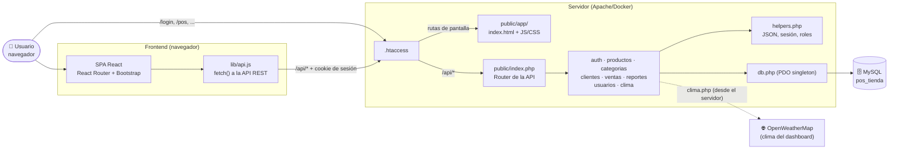
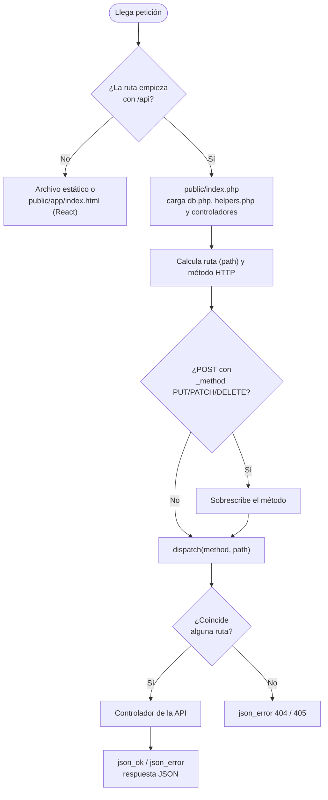
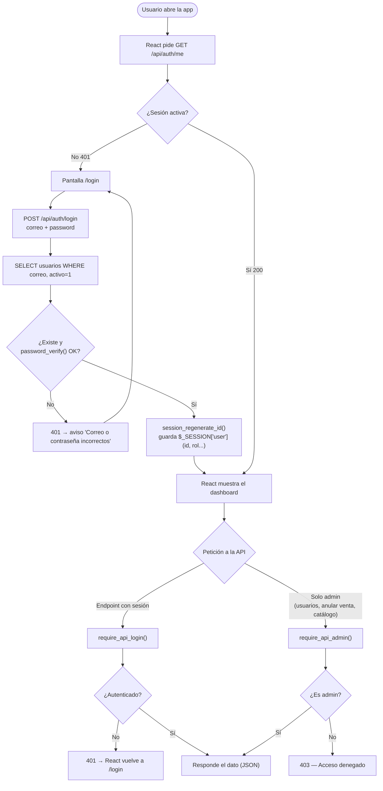
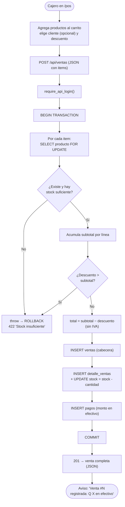

# Diagrama de Flujo — POS Web (Tienda Bugambilias)

Documento que explica **cómo funciona la aplicación**: el ciclo de vida de una
petición, la autenticación por roles y el flujo del proceso central (registrar
una venta). Los diagramas están en formato **Mermaid** (se renderizan solos en
GitHub y en VS Code con la extensión de Mermaid).

---

## 1. Arquitectura general

La aplicación tiene dos partes:

- **Frontend:** SPA en **React** (compilada con Vite). Apache sirve los archivos
  estáticos de `public/app/` y React Router decide qué pantalla mostrar.
- **Backend:** **API REST en PHP puro** (sin framework) con patrón *Front
  Controller*. Todas las peticiones a `/api/*` entran por `public/index.php` y
  siempre responden JSON. El backend no genera HTML.

El navegador consume la API con `fetch` (ver `frontend/src/lib/api.js`).

---

## 2. Ciclo de vida de una petición a la API (Router)

`public/.htaccess` envía las rutas `/api/*` a `public/index.php`, que calcula la
ruta y el método, aplica el *method override* (para PUT/DELETE con archivos) y
hace *match* contra la tabla de rutas. Cualquier otra ruta se responde con el
`index.html` de React.

---

## 3. Autenticación y control de roles

El login se hace contra la API: verifica la contraseña con **bcrypt**
(`password_verify`) contra la tabla `usuarios` y guarda al usuario en
`$_SESSION`. Los roles son **`admin`** y **`cajero`**. React oculta lo que el rol
no permite, pero quien decide es siempre el servidor.

---

## 4. Flujo del proceso central: registrar una venta (POS)

El corazón del sistema. El cajero arma el carrito en `/pos`, el navegador envía
`POST /api/ventas` y el servidor procesa **todo en una transacción atómica**:
valida stock (con `FOR UPDATE`), calcula importes, guarda cabecera + detalle,
descuenta stock, registra el pago y hace `commit`.

Reglas de la tienda: los precios son **finales (sin IVA)**, el cobro es
**siempre en efectivo** y **no se emiten facturas**; el detalle de cada venta se
consulta en pantalla desde el historial.

> **Anulación** (`POST /api/ventas/{id}/anular`): solo **admin**. Devuelve el
> stock de cada línea y marca la venta como `anulada`, también en una transacción.

---

## 5. Módulos y rutas

| Módulo | Pantalla (React) | API REST | Acceso |
|---|---|---|---|
| Autenticación | `/login`, `/registro` | `/api/auth/*` | Público / sesión |
| Dashboard | `/dashboard` | `/api/reportes/dashboard`, `/api/clima` | Sesión |
| Inventario | `/productos` (costo y ganancia: solo admin) | `/api/productos` (CRUD) | Sesión (editar: admin) |
| Categorías | — | `/api/categorias` (CRUD) | Sesión (editar: admin) |
| Punto de Venta | `/pos` | `POST /api/ventas` | Sesión |
| Ventas | `/ventas` (con detalle de cada venta) | `/api/ventas`, `.../anular` | Sesión / admin |
| Clientes | `/clientes` | `/api/clientes` (CRUD) | Sesión |
| Reportes | `/reportes` (rentabilidad: solo admin) | `/api/reportes/*`, `/api/reportes/rentabilidad` | Sesión / admin |
| Usuarios | `/usuarios` | `/api/usuarios` | **Solo admin** |

---

### Resumen del stack

- **Backend:** PHP 8 (PDO + MySQL), consultas preparadas (anti SQL-injection), solo API REST.
- **Frontend:** React + React Router + Bootstrap, `fetch` contra la API REST.
- **Sesión:** cookies de sesión PHP; roles `admin` / `cajero`.
- **Externo:** OpenWeatherMap (clima, consultado desde el servidor), Chart.js y Google Fonts.
- **Infra:** Docker / Apache; desplegable en Railway.
